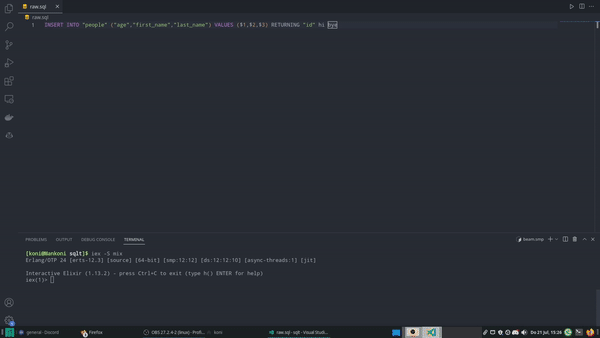

[](https://discord.gg/UDNcTrBagN)
[](https://twitter.com/vkxni)
[](https://github.com/alelievr/Mixture/blob/master/LICENSE)

<p align="center">
</a>
<p>

## SQLT :: PostgeSQL
A simple Ecto-ORM logger written in pure Elixir.

<hr>

> ##### Written in [Elixir](https://elixir-lang.org) 
<a target="_blank" rel="noreferrer"> 
 </a>

> ##### Tested with [PostgreSQL](https://www.postgresql.org/)

 <a target="_blank" rel="noreferrer"> 
 <hr>

### Get started 
First you have to install Elixir (v13.2+) with OTP Version 23+

> - Clone the repository
```
$ git clone https://github.com/vkxni/sqlt

$ cd sqlt
```

> - Install the dependencies
```
$ mix deps.get
```

> - Check if mix is working
```
$ mix status
```

> - Setup the database 

* Info: Your first have to fill out the `.env` file.

If there is data in the database, you can drop it.
```
$ mix ecto.drop
```

Then create the database (tables, schemas ...)
```
$ mix ecto.create


# optional (advanced)
$ mix ecto.migrate
```

> - Launch iex
```
$ iex -S mix
```

> - Run Queries

Inserting, editing, deleting and purging data. 

```
iex> Query.insert

iex> Query.multi_insert

iex> Query.edit

iex> Query.delete

iex> Query.purge
```
<hr>

> - Showcase

Once ran, a `raw.sql` file will be created in the root directory of your folder.

[](https://youtu.be/vt5fpE0bzSY)